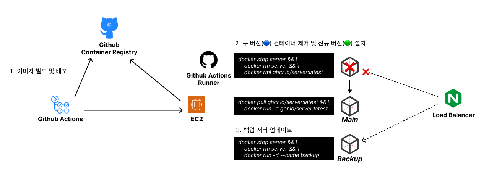

# Blue-Green 배포 전략

Docker 컨테이너 환경에서 Nginx를 이용한 Blue-Green 배포에 대한 가이드입니다.

> [!NOTE]
>
> **Blue-Green 배포란?**
>
> 기존 운영중인 구버전(Blue)에서 새롭게 배포할 신규 버전(Green)으로 라이브 트리팩을 전환하는 배포 방식을 말합니다.
> 때문에 배포할 신규 버전의 환경이 기존 구버전과 동일한 환경으로 구성해야 하며, 트래픽을 제어할 로드밸런서가 필요합니다.

<br />

## Why Nginx?

기존에 운영해왔던 서버는 Nginx 리버스 프록시로 컨테이너에 트래픽을 전달하는 식으로 구성하였습니다.

또한, Nginx로 로드밸런싱을 쉽게 구현할 수 있기 때문에 Nginx + Docker 환경에서의 Blue-Green 배포 환경을 구축하였습니다.

참고로 자동화 파이프라인은 Github Actions를 이용하였습니다.

<br />

## 시나리오 예제

Blue-Green 배포가 어떻게 이루어지는지 예제를 통해 알아보도록 하죠.

Blue-Green 배포 전략의 핵심은 서비스 중단 없이 새로운 버전으로 서비스를 고객에게 전달하는 것이라고 생각합니다. 그러기 위해서는 두 개의 인스턴스가 필요한데요.

하나는 라이브 트래픽을 처리하는 인스턴스, 그리고 메인 서버가 중단되면 대신 트래픽을 처리해줄 수 있는 인스턴스 각각 필요합니다. (간단하죠?)

### 웹 서버 구성하기

웹 서버는 단순히 "Hello, World!"을 출력하는 Node.js를 이용해볼 생각인데요. 차이를 구분하기 위해 "Hello, World 1!"과 "Hello, World 2!"를 출력하는 별개의 인스턴스로 구성해보았습니다.

```javascript
// server-1/index.js
const http = require('http');

const server = http.createServer((req, res) => {
  if (req.method === 'GET' && req.url === '/') {
    res.writeHead(200, { 'Content-Type': 'text/plain' });
    res.end('Hello, Server 1!');
  } else {
    res.writeHead(404, { 'Content-Type': 'text/plain' });
    res.end('Not Found');
  }
});

const PORT = 3000;
server.listen(PORT, () => {
  console.log(`Server is running on http://localhost:${PORT}`);
});

// server-2/index.js
const http = require('http');

const server = http.createServer((req, res) => {
  if (req.method === 'GET' && req.url === '/') {
    res.writeHead(200, { 'Content-Type': 'text/plain' });
    res.end('Hello, Server 2!');
  } else {
    res.writeHead(404, { 'Content-Type': 'text/plain' });
    res.end('Not Found');
  }
});

const PORT = 3000;
server.listen(PORT, () => {
  console.log(`Server is running on http://localhost:${PORT}`);
});
```

### Nginx 설정하기

서버 인스턴스가 준비 되었다면, Nginx에서 리버스 프록시를 구성하고 로드밸런싱을 구현해보겠습니다.

1. /etc/nginx/nginx.conf에서 server 블록에 리버스 프록시를 설정해 줍니다. 이는 Nginx로 들어오는 트래픽을 내부 서버 컨테이너로 전달하는 내부 프록시 서버의 역할을 수행합니다.
   ```
   server {
    location / {
      proxy_pass http://127.0.0.1:3001
    }
   }
   ```
2. upstream 블록을 통해 로드밸런싱을 설정합니다.
   - 트래픽을 전송할 서버의 주소를 Nginx에게 알려주어야 합니다. 아래와 같이 upstream 블록에 생성된 인스턴스의 주소를 설정합니다.
     ```
     server {
      location / {
        # proxy_pass http://127.0.0.1:3000
        proxy_pass http://replication-group
      }
     }
     upstream replication-group {
        server 127.0.0.1:3001 max_fails=3 fail_timeout=10s;
        server 127.0.0.1:3002 backup;
      }
     ```
     Nginx 로드밸런싱은 기본적으로 '라운드 로빈', 'Least-conected', 'ip-hash' 세 가지 방법을 제공하는데요, 기본적으로 '라운드 로빈' 방식을 사용합니다.<br />
     `max_fails=3 fail_timeout=10s;`는 127.0.0.1:3001 주소를 가진 서버에서 3번 이상 요청에 실패할 경우 10초 동안 backup 서버(127.0.0.1:3002)로 트래픽을 전환합니다.

최종적으로 아래와 같은 형태가 됩니다.

```
user nginx;
worker_processes auto;

error_log /var/log/nginx/error.log warn;
pid /var/run/nginx.pid;

events {
  worker_connections 1024;
}

http {
  include /etc/nginx/mime.types;
  default_type application/octet-stream;

  ...

  # 서버를 생성합니다.
  server {
    listen 80;

    # 리버스 프록시 설정: 요청이 들어오면 Docker Compose 내의 서버 인스턴스로 전달합니다.
    location / {
        proxy_pass http://replication-group;
    }
  }

  # 업스트림 블럭을 통해 로드밸런싱을 구현할 수 있습니다.
  # 메인 서버(server1)에 Timeout은 10초로, 3번 이상 요청이 실패하면 백업 서버(server2)로 트래픽을 돌립니다.
  upstream replication-group {
    server server1:3000 max_fails=3 fail_timeout=10s;
    server server2:3000 backup;
  }
}
```

> upstream 블록을 보시면 server의 주소가 `server1:3000`, `server2:3000`으로 설정되어 있습니다.
> 이는 Docker Compose로 구성된 서버 1, 2번의 컨테이너 이름으로, 이번 예제에서는 도커 네트워크에서 컨테이너끼리 통신하기 위한 호스트명 정도로 이해해주시면 되겠습니다.

## Docker Compose를 이용한 예제 환경구축

Docker Compose 구성은 아래와 같습니다.

```yml
version: '3.0'

services:
  server1:
    image: node:alpine
    container_name: server1
    working_dir: /usr/src/app
    volumes:
      - ./server-1:/usr/src/app
    command: ['node', 'index.js']
    ports:
      - '3001:3000'

  server2:
    image: node:alpine
    container_name: server2
    working_dir: /usr/src/app
    volumes:
      - ./server-2:/usr/src/app
    command: ['node', 'index.js']
    ports:
      - '3002:3000'

  load_balancer:
    image: nginx
    container_name: load_balancer
    ports:
      - '80:80'
    volumes:
      - ./nginx/nginx.conf:/etc/nginx/nginx.conf

networks:
  default:
    driver: bridge
```

컨테이너 스택은 웹서버 두 개와 로드밸런서인 Nginx가 있습니다.

- `server1`: "Hello, World 1!" 출력하는 웹서버
- `server2`: "Hello, World 2!" 출력하는 웹서버
- `load_balancer`: Nginx 프록시 서버

## 자동화 파이프라인 구축

컨테이너 이미지 레지스트리는 GHCR(Github Container Registry)를 이용하였습니다. 기존에 사용하던 DockerHub는 이미지가 두 개 이상부터 유료 플랜을 사용해야 하며, ECR 환경도 고려해보았지만 관리 포인트가 늘어난다고 생각하여 쉽고 간단한 GHCR을 사용하게 되었습니다.

이제 본격적으로 자동화 파이프라인을 구축해보겠습니다. 먼저, 필요한 환경 구성은 다음과 같습니다.

1.  `Github Personal Access Token`: GHCR에 컨테이너 이미지를 등록하고 Pull 하기 위한 비밀키입니다.
2.  `Secrets and Variables`: Github Actions 파이프라인에서 동작하는 머신에서 안전하게 비밀키를 다루기 위해 비밂키를 변수로 등록합니다.
3.  `Actions Runner`: Github Actions가 클라우드 또는 온프레미스 서버를 제어할 수 있도록 해주는 프로그램을 설치해야 합니다.

> 저는 EC2 환경에서 웹서버를 구동 중이기 때문에 Actions Runner를 설치하고 워크플로우 작업을 설정하였습니다.

구성이 완료되었다면 아래와 같이 워크플로우를 구성해주시면 되겠습니다.

```yml
name: Blue-Green Deployment

env:
  DOCKER_IMAGE: ghcr.io/${{ github.repository }}
  DOCKER_CONTAINER: server-app

on:
  push:
    branches: ['main']

jobs:
  build:
    runs-on: ubuntu-latest

    steps:
      - name: Checkout source code
        uses: actions/checkout@v3
      - name: Setup docker build
        id: buildx
        uses: docker/setup-buildx-action@v2
      - name: Login to ghcr
        uses: docker/login-action@v2
        with:
          registry: ghcr.io
          username: ${{ github.actor }}
          password: ${{ secrets.GHCR_TOKEN }}
      - name: Build and push
        id: docker_build
        uses: docker/build-push-action@v3
        with:
          context: .
          push: true
          tags: ${{ env.DOCKER_IMAGE }}:latest

  deploy:
    needs: build
    runs-on: [self-hosted, Linux, X64]

    steps:
      - name: Login to ghcr
        uses: docker/login-action@v2
        with:
          registry: ghcr.io
          username: ${{ github.repository_owner }}
          password: ${{ secrets.GHCR_TOKEN }}
      - name: Run docker
        run: |
          docker stop ${{ env.DOCKER_CONTAINER }} && docker rm ${{ env.DOCKER_CONTAINER }} && docker rmi ${{ env.DOCKER_IMAGE }}:latest
          docker run -dp 8112:8112 --name ${{ env.DOCKER_CONTAINER }} --network redis-net ${{ env.DOCKER_IMAGE }}:latest

  backup:
    needs: deploy
    runs-on: [self-hosted, Linux, X64]

    steps:
      - name: Login to ghcr
        uses: docker/login-action@v2
        with:
          registry: ghcr.io
          username: ${{ github.repository_owner }}
          password: ${{ secrets.GHCR_TOKEN }}
      - name: Run docker
        run: |
          docker stop ${{ env.DOCKER_CONTAINER }}-backup && docker rm ${{ env.DOCKER_CONTAINER }}-backup
          docker run -dp 8113:8112 --name ${{ env.DOCKER_CONTAINER }}-backup --network redis-net ${{ env.DOCKER_IMAGE }}:latest

  notification:
    needs: deploy
    permissions:
      contents: read
      actions: read
    runs-on: ubuntu-latest

    steps:
      - name: Action Slack
        uses: 8398a7/action-slack@v3
        with:
          status: ${{ job.status }}
          author_name: boy672820
          fields: repo,message,commit,author,action,eventName,ref,workflow,job,took
          if_mention: failure,cancelled
        env:
          SLACK_WEBHOOK_URL: ${{ secrets.SLACK_WEBHOOK_URL }}
        if: always()
```

### Github Actions 워크플로우 과정



main 브랜치에 코드가 변합되면 워크플로우가 실행됩니다.

1.  도커 컨테이너 이미지로 빌드가 시작됩니다.
2.  빌드가 완료되면 깃헙 레지스트리(GHCR)에 이미지를 업로드합니다.
3.  빌드가 완료되면 Actions Runner를 통해 서버를 제어합니다.
    1. 기존에 실행되고 있는 메인 서버 컨테이너를 종료하고 이미지까지 제거합니다.
    2. 이 과정에서 메인 서버는 죽고 Nginx가 메인 서버가 죽은걸 확인한 후 백업 서버로 트래픽을 전환합니다.
    3. 배포된 메인 서버 이미지를 다운로드하여 컨테이너화 합니다.
4.  3번 작업이 완료되면 백업 서버 또한 같은 방식으로 업데이트합니다.
    1. Actions Runner를 통해 백업 서버 컨테이너와 이미지를 제거합니다.
    2. 설치된 이미지를 이용하여 백업 컨테이너를 실행합니다.
